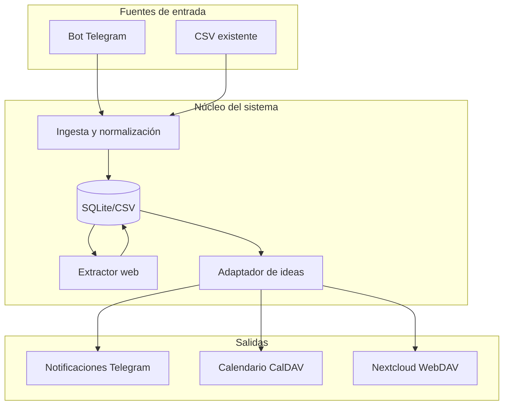

# Plan: Sistema de Automatización de Convocatorias Artísticas

## Contexto

Proyecto en fase inicial con `[.env](ConvocAUTOrias/.env)` ya configurado (Telegram, CalDAV/Nextcloud). CSV de origen: `Excel subvenciones act 3 feb.xlsx - convocatorias.csv`; migrar con `scripts/procesar_csv.py`. Sin coste adicional: Telegram Bot API es gratuito; scraping con requests/BeautifulSoup; IA con Ollama local (modelos gratuitos).

---

## Arquitectura general




---

## Fase 1: Automatización local (prioridad)

### 1.1 Estructura del proyecto

```
ConvocAUTOrias/
├── .env                    # (existente)
├── .gitignore              # Incluir .env, __pycache__, *.db
├── requirements.txt
├── README.md
├── config.py               # Carga variables de entorno
├── convocatorias.csv       # Base de datos inicial (o migrar a SQLite)
├── src/
│   ├── __init__.py
│   ├── ingest.py           # Ingesta desde CSV y Telegram
│   ├── scraper.py          # Extracción de datos de URLs
│   ├── adaptador.py        # Adapta ideas a formularios (Ollama)
│   ├── notifier.py         # Envía resúmenes por Telegram
│   └── db.py               # Acceso a datos (CSV/SQLite)
├── ideas/                  # Carpeta con archivos .txt de ideas
├── bot/
│   └── telegram_bot.py    # Bot que recibe URLs y comandos
└── scripts/
    ├── run_bot.py         # Ejecutar bot en local
    ├── procesar_csv.py    # Procesar CSV existente
    └── revisar_convocatorias.py  # Revisar plazos y notificar
```

### 1.2 Esquema de datos (CSV / SQLite)


| Campo         | Tipo     | Descripción                    |
| ------------- | -------- | ------------------------------ |
| id            | str      | UUID o hash                    |
| url           | str      | URL de la convocatoria         |
| titulo        | str      | Título extraído                |
| descripcion   | str      | Resumen/descripción            |
| plazo_fin     | date     | Fecha límite                   |
| requisitos    | str      | Requisitos principales         |
| estado        | str      | pendiente, procesada, expirada |
| fecha_ingesta | datetime | Cuándo se añadió               |
| fuente        | str      | telegram, csv, manual          |


### 1.3 Bot de Telegram (sin coste)

- **python-telegram-bot** (gratuito, sin API key extra).
- Comandos: `/añadir <url>`, `/listar`, `/revisar <id>`, `/ayuda`.
- Al enviar una URL sin comando: se interpreta como nueva convocatoria y se añade al CSV/DB.
- El bot puede correr en local con `python -m bot.telegram_bot` (polling).

### 1.4 Extractor web (scraping)

- **requests** + **BeautifulSoup4** para HTML estático.
- Estrategia híbrida:
  - **Extracción genérica**: título (`<h1>`, `<title>`), fechas con regex, párrafos principales.
  - **readability-lxml** o **trafilatura** para extraer contenido principal sin parser por sitio.
- Para sitios con JavaScript: **Playwright** (gratuito) como opción en fases posteriores.

### 1.5 Adaptador de ideas (sin APIs de pago)

- **Ollama** en local con un modelo pequeño (ej. `llama3.2`, `mistral`).
- Entrada: texto de convocatoria + archivos de `ideas/*.txt`.
- Salida: borrador de proyecto adaptado al formulario (texto estructurado).
- Si Ollama no está instalado: modo "plantilla" que rellena campos con placeholders.

### 1.6 Ideas desde archivos de texto

- Carpeta `ideas/` con `.txt` (ej. `biografia.txt`, `proyecto_tipo.txt`, `portfolio.txt`).
- El adaptador concatena estos archivos como contexto y genera propuestas alineadas con cada convocatoria.

---

## Fase 2: Servicio en VPS con Docker

### 2.1 Dockerización

- `Dockerfile` con Python 3.11-slim.
- `docker-compose.yml`: servicio del bot + (opcional) worker de revisión periódica.
- Variables de entorno desde `.env` o secrets de Docker.

### 2.2 Ejecución continua

- Bot en modo polling o webhook (si tienes dominio/HTTPS).
- Cron interno o `schedule` para revisar plazos diariamente y enviar recordatorios por Telegram.

---

## Fase 3: Integración CalDAV y Nextcloud

- Ya tienes credenciales en `.env` para CalDAV y Nextcloud.
- **caldav** (Python): crear eventos con plazos de convocatorias.
- **nextcloud-api** o WebDAV: subir borradores de proyectos a la carpeta `Convocatorias`.

---

## Consideraciones técnicas

1. **Seguridad**: Añadir `.env` a `.gitignore` y no subir credenciales a repositorios.
2. **Scraping**: Respetar `robots.txt`, delays entre peticiones, User-Agent identificable.
3. **Telegram**: Límites de rate (ej. ~30 msg/s); para uso personal suele ser suficiente.
4. **Ollama**: Requiere ~4–8 GB RAM para modelos pequeños; opcional en Fase 1.

---

## Orden de implementación sugerido

1. Estructura base + `requirements.txt` + `config.py`.
2. Módulo `db.py` y esquema CSV/SQLite.
3. `scraper.py` con extracción genérica.
4. Bot Telegram que recibe URLs y las guarda.
5. Script `revisar_convocatorias.py` para plazos y notificaciones.
6. Carpeta `ideas/` y `adaptador.py` (plantilla primero, Ollama después).
7. Docker y despliegue en VPS.
8. Integración CalDAV y Nextcloud.

